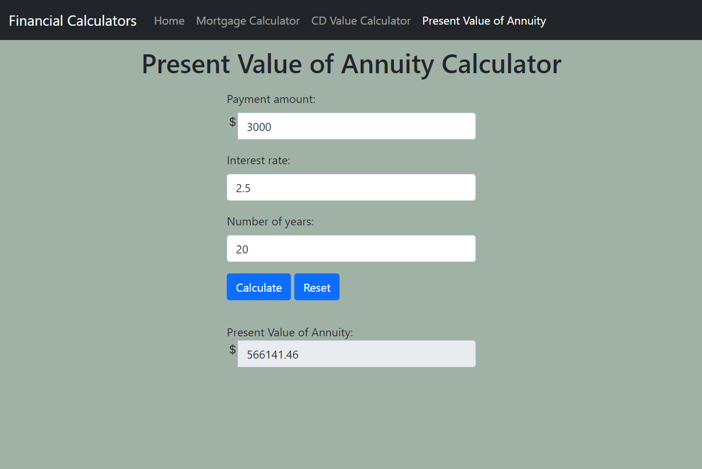

# Financial Calculator

A website that has 3 calculators for your financial needs.


## Features

1. Homepage - contains links to the 3 calculators
2. Mortagage calculator - calculate out how much a monthly payment for a loan would be, as well as how much interest you would pay over the life of the loan. Includes a reset button that resets the input fields and an error message for when your input is invalid.
3. Future CD Value calculator - determines the future value of a one-time deposit assuming compound interest. Includes a reset button that resets the input fields and an error message for when your input is invalid.
4. Present Value of Annuity calculator -  determines the present value of an ordinary annuity. Includes a reset button that resets the input fields and an error message for when your input is invalid.


## Screenshots

Homepage View:


Mortgage Calculator Page View:


CD Calculator Page View:


Present Value of Annuity Calculator Page View:


Error message that occurs when invalid input (Mortgage Page):


## Usage/Examples

```javascript
    if (principalAmount == "" || interestRate == "" || loanLength == ""){
        document.getElementById("monthlyPay").value = "";
        document.getElementById("totalInterest").value = "";
        document.getElementById("errorMortgageMessage").innerHTML = "ERROR: One or more of your input values are invalid!";
        return;
    }
```

Checks if the input fields are empty or not. If it is, it shows an message and empties the output fields if it contained anything. It's interesting because of how simple it is to check.


## Authors

Kaye Poblete
- [@kayepoblete](https://www.github.com/kayepoblete)

